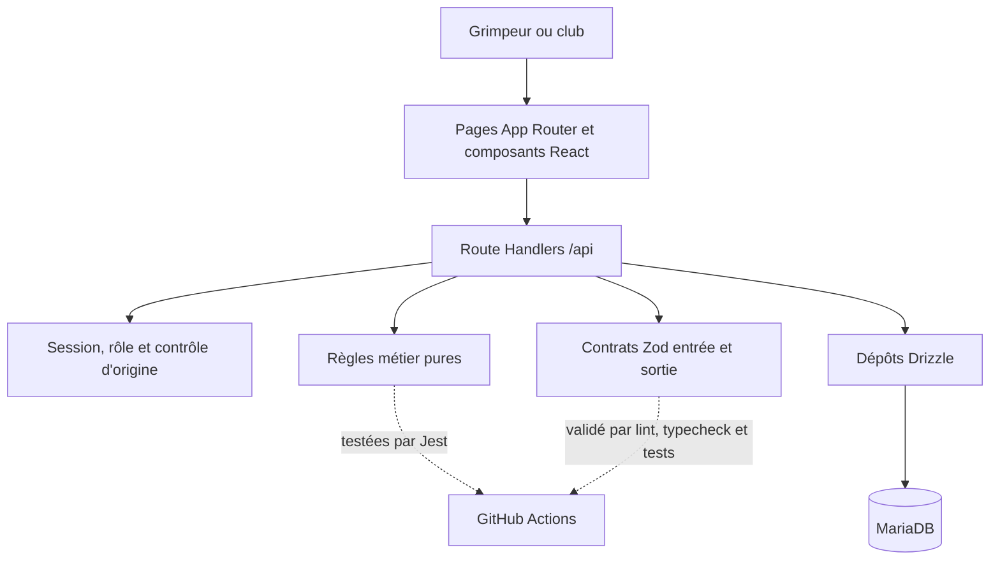

# Architecture et prototype maintenable - C2.2.1

## 1. Objet et périmètre démontré

Ce document présente l'architecture réellement livrée pour la compétence C2.2.1 du bloc BC02. Le prototype évalué couvre deux parcours métier complets en plus de l'authentification et des profils déjà présents :

- recherche de grimpeurs, filtrage et gestion des demandes de partenariat ;
- publication d'événements par un club, consultation, inscription et suivi des participants.

Les user stories de référence sont décrites dans [`01_PERIMETRE_FONCTIONNEL_ET_USER_STORIES.md`](./01_PERIMETRE_FONCTIONNEL_ET_USER_STORIES.md). Le fil social, la messagerie, les topos collaboratifs et le calcul de distance GPS restent hors du prototype BC02.

## 2. Choix techniques vérifiés

| Élément | Choix dans la version livrée | Justification |
| --- | --- | --- |
| Framework web | Next.js 16.2.10, App Router | Routage, rendu serveur, composants client et API dans un même projet TypeScript. |
| Interface | React 19, Tailwind CSS, composants `src/components/ui/` | Réutilisation du design system et adaptation responsive sans dupliquer les contrôles. |
| Formulaires | React Hook Form et Zod | Validation accessible côté client, puis nouvelle validation Zod côté API. |
| Backend | Route Handlers Next.js | Endpoints colocalisés avec l'application et contrôles d'accès exécutés sur le serveur. |
| Persistance | MariaDB 11.4 et Drizzle ORM | Modèle typé, migrations versionnées et requêtes sans SQL brut dans le code applicatif. |
| Tests | Jest 30 | Règles métier pures testées sans dépendre de l'interface ou de MariaDB. |
| Livraison | Docker et GitHub Actions | Environnements reproductibles et contrôles automatisés avant intégration. |

Le dépôt impose TypeScript strict. Les structures externes sont traitées comme `unknown`, validées, puis converties en types métier. Les réponses des nouveaux endpoints sont elles aussi vérifiées par des schémas Zod avant envoi.

## 3. Vue en couches

Le schéma source est versionné dans [`architecture-prototype-c221.mmd`](./architecture-prototype-c221.mmd).

### Présentation

Les pages serveur chargent l'utilisateur et les données initiales, puis redirigent un visiteur non authentifié. Les composants client gèrent les filtres, formulaires et retours immédiats :

- `src/app/app/matching/page.tsx` et `src/features/matching/components/matching-directory.tsx` ;
- `src/app/app/partnerships/page.tsx` et `src/features/matching/components/partnership-center.tsx` ;
- `src/app/app/events/page.tsx`, `events-board.tsx` et `event-form.tsx`.

Les contrôles possèdent des libellés, les messages dynamiques utilisent `aria-live` ou `role="alert"`, et les commandes restent utilisables au clavier. Les grilles passent de une à plusieurs colonnes selon les points de rupture Tailwind.

### API et application

| Route | Méthode | Rôle | Traitement |
| --- | --- | --- | --- |
| `/api/matching` | `GET` | Grimpeur | Retourne au maximum 100 profils publics ouverts au matching, sans adresse électronique. |
| `/api/partnerships` | `GET`, `POST` | Grimpeur | Liste ou crée une demande unique pour une paire. |
| `/api/partnerships/[requestId]` | `PATCH` | Destinataire | Accepte ou refuse uniquement une demande en attente. |
| `/api/events` | `GET`, `POST` | Authentifié / club | Liste l'agenda ou crée un événement futur. |
| `/api/events/[eventId]` | `PATCH` | Club propriétaire | Modifie ou annule un événement du club. |
| `/api/events/[eventId]/registrations` | `POST`, `DELETE` | Grimpeur | Inscrit, désinscrit ou réactive une inscription. |

Chaque mutation suit la séquence : contrôle d'origine, session, rôle, paramètres, corps Zod, autorisation sur la ressource, règle métier, écriture Drizzle et réponse Zod.

### Métier

Les règles indépendantes de l'infrastructure sont regroupées dans :

- `matching-rules.ts` : conversion sûre des JSON, clé de paire stable et combinaison des filtres ;
- `event-rules.ts` : cohérence des dates, capacité minimale et conditions d'inscription.

Ce découpage permet de tester rapidement les cas nominaux et les limites. L'annuaire est ordonné par nom d'affichage puis identifiant, ce qui rend les résultats déterministes. Les filtres localité/nom, discipline, niveau, disponibilité et environnement sont combinés.

### Données

La migration `drizzle/0004_majestic_ken_ellis.sql` ajoute :

- l'unicité d'un profil par utilisateur ;
- `partnership_requests`, avec une clé de paire unique et les statuts `pending`, `accepted`, `declined` ;
- les informations de type, description, lieu, fin et statut des événements ;
- `event_registrations`, unique par couple événement/utilisateur.

Une inscription est réalisée dans une transaction qui verrouille la ligne de l'événement avec `FOR UPDATE`. La capacité est recalculée sous verrou avant insertion ou réactivation. Deux requêtes concurrentes ne peuvent donc pas valider la même dernière place.

## 4. Paradigmes et maintenabilité

- **Architecture par fonctionnalité** : matching et événements possèdent chacun schémas, composants, règles, réponses et dépôt.
- **Rendu hybride** : les Server Components assurent le chargement initial et l'autorisation ; les Client Components ne prennent en charge que l'interaction.
- **Programmation fonctionnelle** : les validations de dates, capacité et filtres sont des fonctions pures sans état global.
- **Repository** : Drizzle et la forme des tables restent confinés aux fichiers d'accès aux données.
- **Défense en profondeur** : validation client pour l'ergonomie, validation serveur pour la sécurité, contraintes uniques en base pour l'intégrité.
- **Évolution additive** : une nouvelle migration est générée ; aucune migration historique n'est modifiée.

Ajouter un nouveau type d'événement demande une évolution coordonnée de l'enum Drizzle, du schéma Zod et des libellés d'interface. Ajouter un nouveau filtre de matching reste localisé au contrat, à la fonction pure et au contrôle d'interface.

## 5. Traçabilité des user stories

| User story | Interface | Règle ou protection | Preuve exécutée le 20 juillet 2026 |
| --- | --- | --- | --- |
| US-MATCH-01 | `/app/matching` | Profil courant exclu, profil public uniquement, filtres combinés et ordre stable | Page HTTP 200, API retournant uniquement Nassim pour le compte Lina. |
| US-MATCH-02 | `/app/matching`, `/app/partnerships` | Paire unique, auto-demande refusée, réponse réservée au destinataire | Demande Lina vers Nassim puis acceptation avec le compte Nassim. |
| US-EVENT-01 | `/app/events`, formulaire club | Dates futures, fin après début, propriétaire requis, capacité protégée | Création, modification de capacité et annulation par le compte club. |
| US-EVENT-02 | `/app/events` | Événements futurs triés, capacité calculée | Deux événements de démonstration retournés dans l'ordre chronologique. |
| US-EVENT-03 | `/app/events` | Transaction, verrou, unicité et réactivation | Désinscription puis réinscription de Lina, compteur passé de 1 à 0 puis à 1. |
| US-EVENT-04 | `/app/events` | Participants fournis uniquement au club propriétaire | Réponse club avec `isOwner: true`; réponses grimpeur avec `participants: []`. |

## 6. Vérifications réalisées

| Contrôle | Résultat |
| --- | --- |
| Migration complète sur MariaDB temporaire | Succès, migrations `0000` à `0004` appliquées. |
| Seed reproductible | Succès, 2 événements, 1 demande et 2 inscriptions actives. |
| Routes des trois écrans connectés | HTTP 200. |
| Tests unitaires | 69 tests réussis sur 69. |
| ESLint | Succès, aucune erreur ni avertissement. |
| TypeScript strict | Succès. |

Les comptes du seed permettent une démonstration immédiate avec le mot de passe documenté dans le script : Lina envoie les demandes, Nassim possède une demande entrante, et Club Alpin Lyon administre les événements.

## 7. Limites et suites

- La recherche par localité est textuelle ; le rayon géographique et la cartographie sont reportés.
- La limite de 100 profils convient au prototype. Une pagination et des index de recherche seront nécessaires à plus grande échelle.
- Les contrôles HTTP ont été exécutés localement ; leur automatisation dans la CI avec MariaDB relève de l'étape C2.2.2 suivante.
- Les captures desktop et mobile seront ajoutées à l'annexe visuelle du dossier final.
- Un audit RGAA complet et la matrice OWASP restent traités dans C2.2.3 ; ce document ne revendique pas une conformité globale.

Ces limites sont explicites afin de distinguer une architecture démontrable et maintenable d'une version de production à grande échelle.
