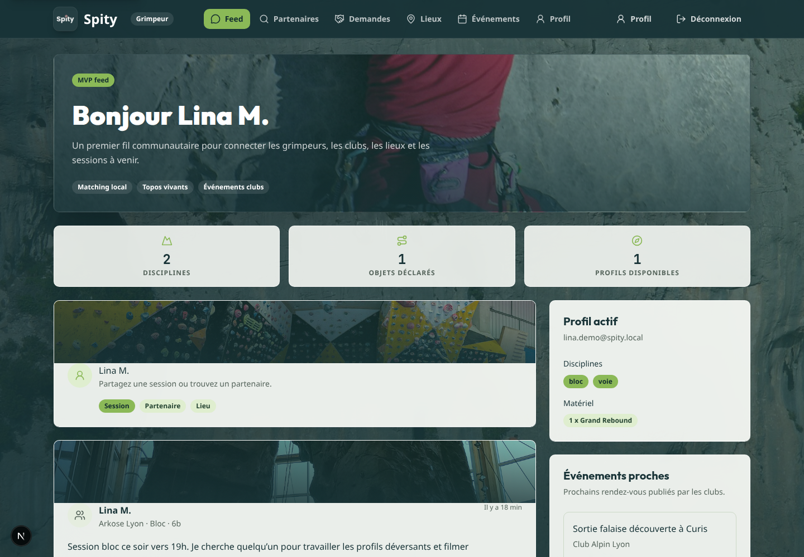
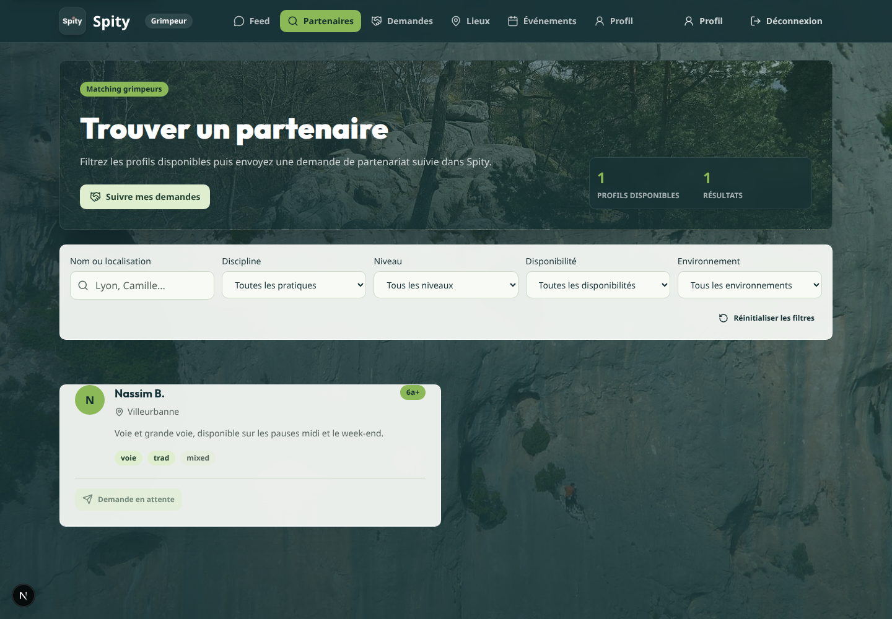
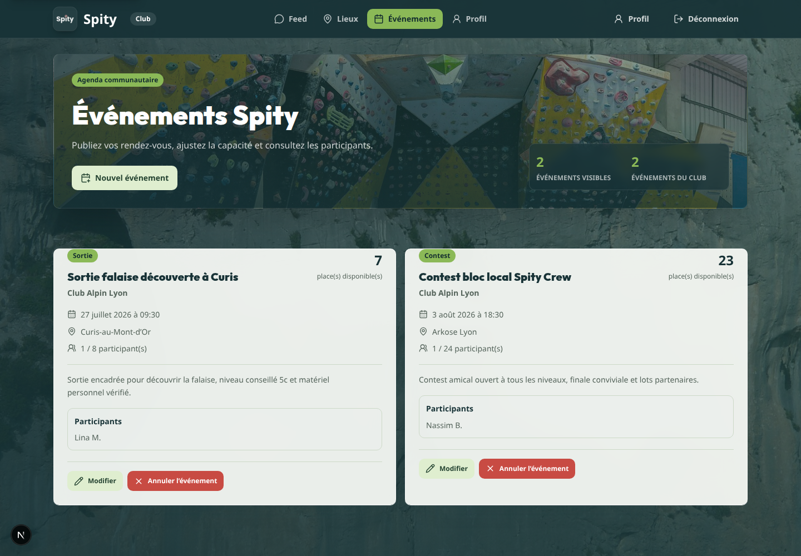
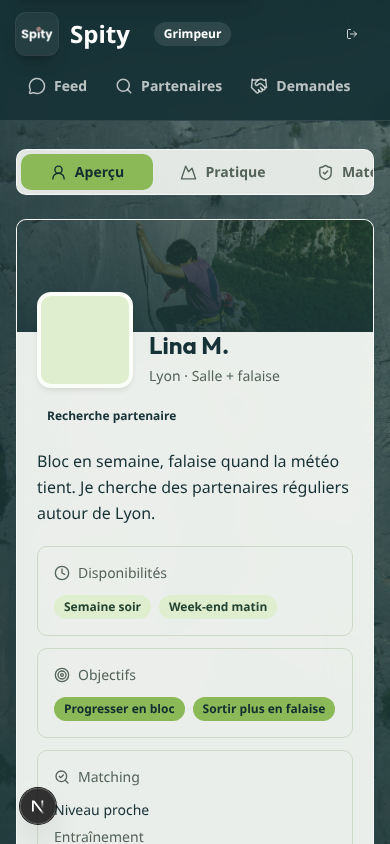
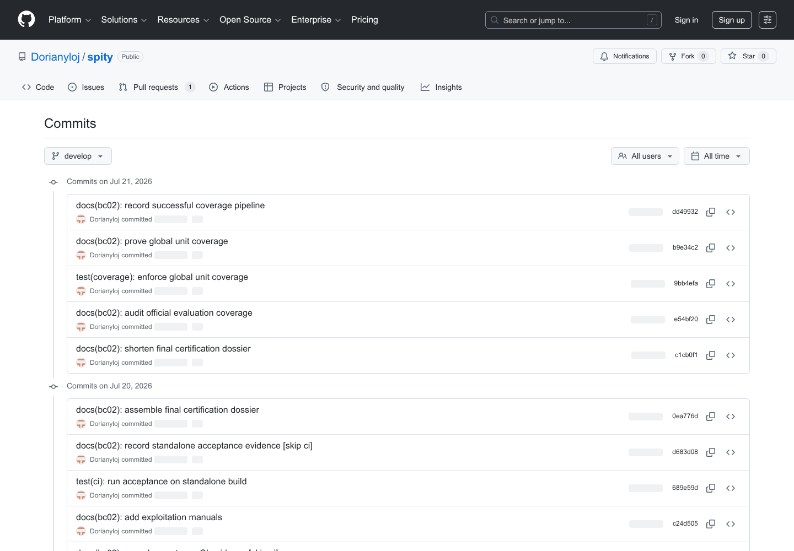
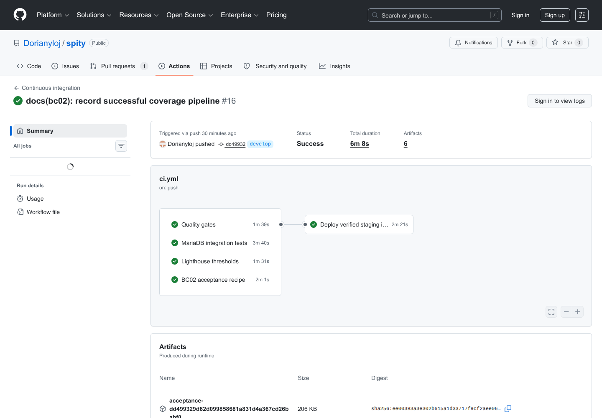
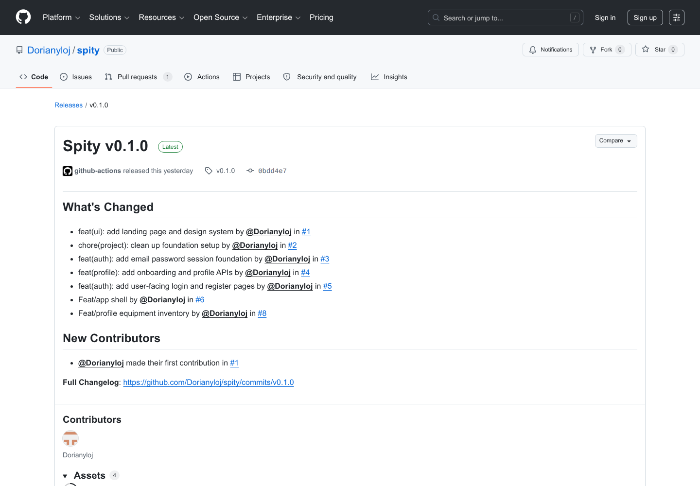

# Annexes visuelles et preuves d'exécution - BC02

## Objet des annexes

Ces annexes regroupent les preuves visuelles essentielles sans alourdir le corps du dossier. Les captures produit sont générées depuis les comptes de démonstration avec `npm run docs:capture`. Les captures GitHub publiques sont régénérables avec `npm run docs:capture:github`.

| Annexe | Preuve | Critères principalement concernés |
| --- | --- | --- |
| A1 | Tableau de bord grimpeur | C2.2.1, C2.3.1 |
| A2 | Recherche et filtres de matching | C2.2.1, C2.3.1 |
| A3 | Gestion des événements par un club | C2.2.1, C2.3.1 |
| A4 | Profil mobile | C2.2.1, C2.2.3 |
| A5 | Historique Git de `develop` | C2.2.4, C2.3.2 |
| A6 | Pipeline CI et staging réussis | C2.1.2, C2.2.2, C2.2.3, C2.3.1 |
| A7 | Release stable `v0.1.0` | C2.2.4, C2.4.1 |

## A1 - Tableau de bord grimpeur

La vue d'accueil authentifiée centralise le profil, les recommandations de partenaires, le matériel et les événements. Elle prouve l'intégration cohérente des fonctions F02, F03, F06 et F07.

## A2 - Recherche de partenaires

L'annuaire permet de combiner recherche textuelle, discipline, niveau, disponibilité et environnement, puis d'envoyer une demande de partenariat.

## A3 - Gestion des événements

Le rôle club peut publier, modifier et annuler un événement, suivre sa capacité et consulter les participants inscrits.

## A4 - Reflow mobile du profil

La vue profil reste utilisable à 390 pixels de large. Elle complète les audits automatisés par une preuve du reflow et de l'absence de défilement horizontal incohérent.

## A5 - Historique Git de la branche develop

La [branche `develop`](https://github.com/Dorianyloj/spity/commits/develop/) expose des commits courts et conventionnels. Les évolutions de couverture, de documentation et de correction restent reliées à un SHA.

## A6 - Pipeline CI complet et staging

Le [run GitHub Actions 29828300315](https://github.com/Dorianyloj/spity/actions/runs/29828300315) réussit les portes qualité, MariaDB/accessibilité, Lighthouse et recette BC02 avant le staging. Six artefacts sont publiés, dont le rapport de couverture globale.

## A7 - Release stable Spity v0.1.0

La [release `v0.1.0`](https://github.com/Dorianyloj/spity/releases/tag/v0.1.0) relie un tag, un SHA, un changelog et quatre artefacts téléchargeables. Elle constitue la version stable du prototype présenté.

## Traçabilité des fichiers

Les manifestes [`annexes/captures/manifest.json`](./annexes/captures/manifest.json) et [`annexes/github/manifest.json`](./annexes/github/manifest.json) enregistrent la date, la source et le fichier de chaque capture. Le manifeste du livrable conserve séparément les empreintes SHA-256 du HTML, du PDF et des trois documents assemblés.
